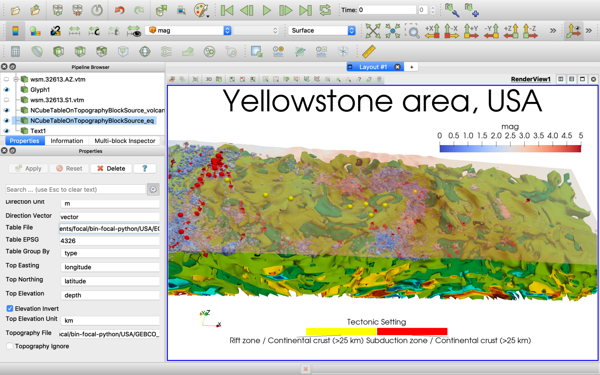

# ParaView-Yellowstone

[ParaView](https://www.paraview.org/download/) project for plate tectonics and volcanism study on Yellowstone area, USA.

# How it looks

# How to open the project

Use [ParaView](https://www.paraview.org/download/) File -> Load State menu item to load the project.pvsm project file and specify "data" subdirectory as "Data Directory".

# Authors

A.V.Durandin
https://orcid.org/0000-0001-6468-9757 (ORCID)
E-mail: durandin.andrew@gmail.com

A.O.Pechnikov
https://orcid.org/0000-0001-9626-8615 (ORCID)
E-mail: pechnikov@mobigroup.ru
